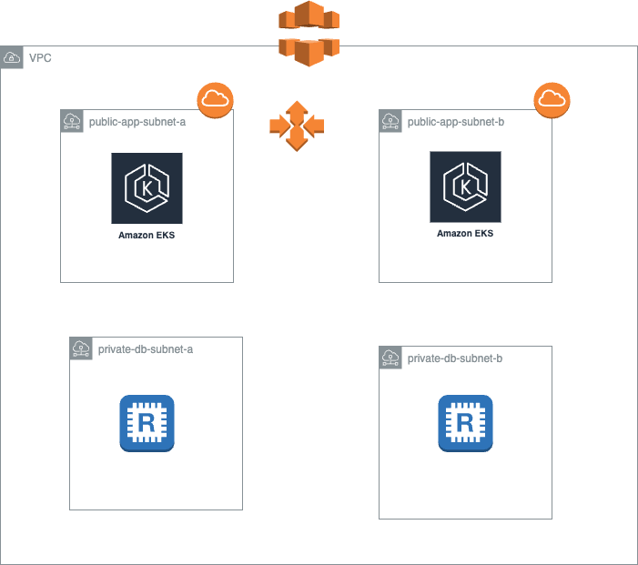
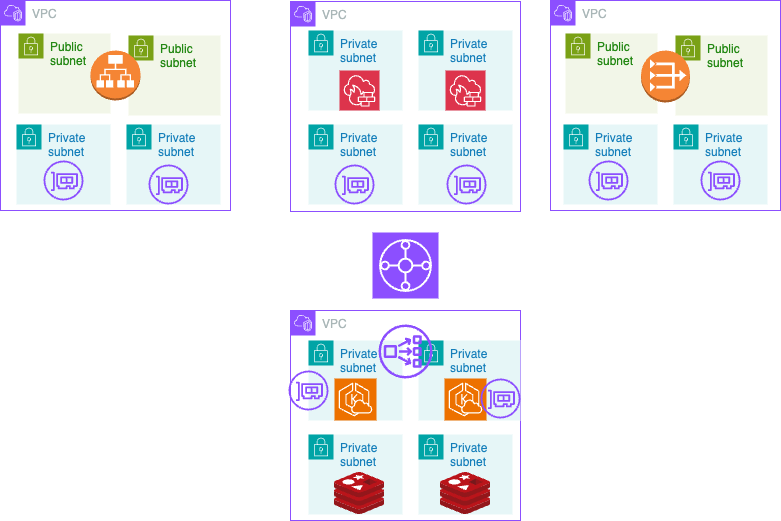
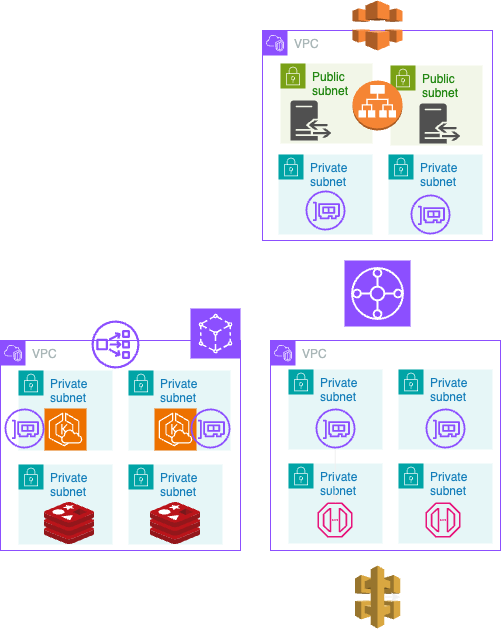
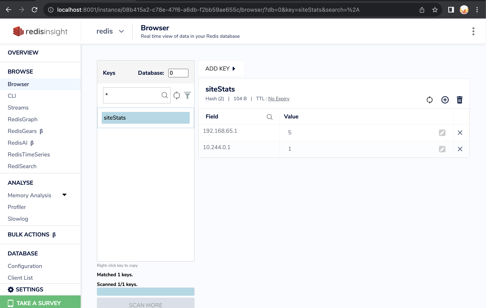
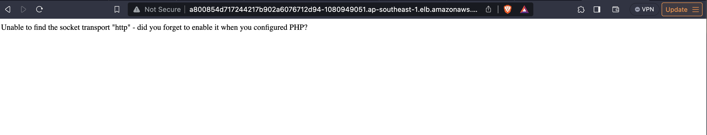

# Dear Interviewer I have completed my assesment and also I am sharing few architecture design that I have done based on my experience.

# Architecture design 1:
   This is the simple architecture design for testing and demo purposes.Here the EKS is deployed in a public subnet and the application is deployed using a helm chart. The redis can be deployed using aws redis cache in private subnets.

# Architecture design 2:
   This architecture is based on centralized ingress and egress architecture. In this architecture EKS Cluster and DB are in the isolated private VPC having connection through transit gateway.All the ingress and egress packets are scanned by AWS Network Firewall.

# Architecture design 3:
   This architecture the request is forward from cloudfront to alb of the reverse proxy based on path,it will be routed to a private api gateway url. From the API gateway, it will be routed to application VPC  NLB. From NLB, the request will be routed to appmesh virtual gateway, from there it will be reached to corresponding service.

# Deployment:
  Based on use case I created two seperate folder. One for infra deployment and other for application deployment, As added the corresponding .gitlab-ci.yaml file for CICD deployment for both infra and application. I have used php code for this application and I tested in my localmachine on minikube with nodeport service using helm deployment. I am able to achieve the output as I attached the image that can connect with local redis cluster.

In aws I am facing http socket error, that I am working on, This issue is comming only when I give redis url to connect.But I tested I able to connect from pod to aws redis cache. 

